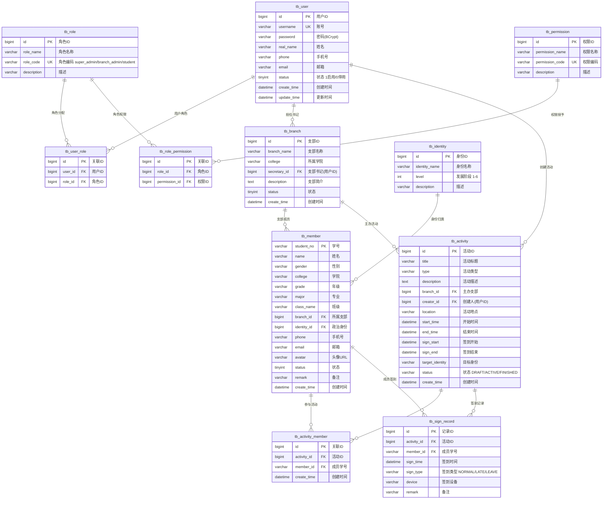

# 党建云平台 — 数据库 ER 图

## 表清单

| # | 表名 | 说明 | Java 实体 |
|---|------|------|-----------|
| 1 | `tb_user` | 用户账号 | `User.java` |
| 2 | `tb_role` | 系统角色 | `Role.java` |
| 3 | `tb_permission` | 权限定义 | `Permission.java` |
| 4 | `tb_user_role` | 用户-角色关联 | `UserRole.java` |
| 5 | `tb_role_permission` | 角色-权限关联 | `RolePermission.java` |
| 6 | `tb_branch` | 党支部 | `Branch.java` |
| 7 | `tb_identity` | 政治身份 | `Identity.java` |
| 8 | `tb_member` | 成员信息 | `Member.java` |
| 9 | `tb_activity` | 党建活动 | *(待实现)* |
| 10 | `tb_activity_member` | 活动-成员关联 | *(待实现)* |
| 11 | `tb_sign_record` | 签到记录 | *(待实现)* |

> 在 VS Code 中安装 **Markdown Preview Mermaid Support** 插件即可直接预览 ER 图。
> 也可以复制 mermaid 代码到 [mermaid.live](https://mermaid.live) 导出 PNG/SVG。
